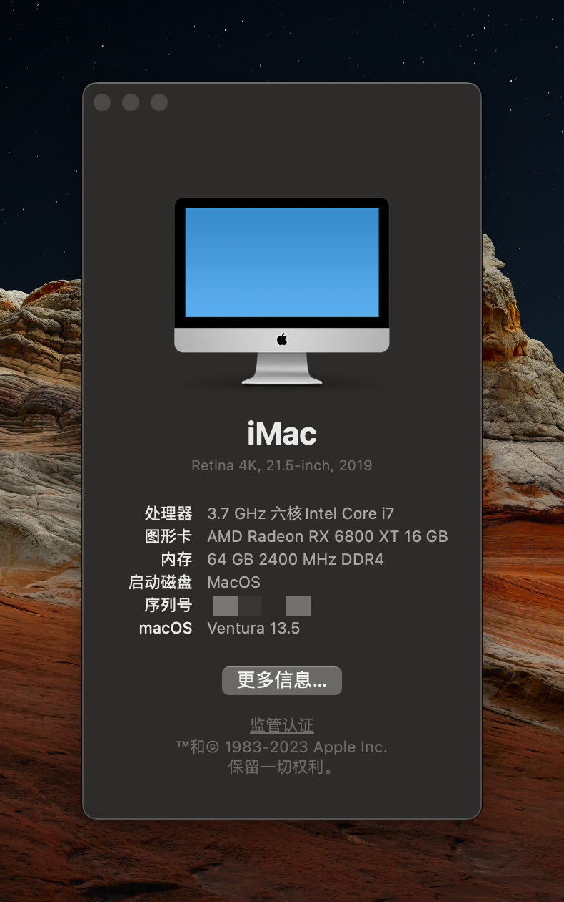

# Asrock Z390 Pro4 OC Hackintosh
====================== 
OC：0.90 
MacOS：13.5 
====================== 
* 主板：Asrock Z390 Pro4 
* 显卡：AMD 6800XT 16G (Type-C) 
- 显示器：(1)Appley Display Studio 
        (2)飞利浦346P1CRH （DP） 
- 硬盘：三星 970 EVO Plus 2TB 
- 音响：Boss C5 （Usb audio） 
- Wifi/蓝牙：BCM94360cd (PCI-E/免驱） 
- 鼠标：罗技mx master 3 for mac (蓝牙） 
- 键盘：京造 K2 （蓝牙） 

- [x] 接力：Pass 
- [x] 随航：Pass 
- [x] 隔空投送：Pass 
- [x] FaceTime：Pass 
- [x] USB端口：Pass 
====================== 

